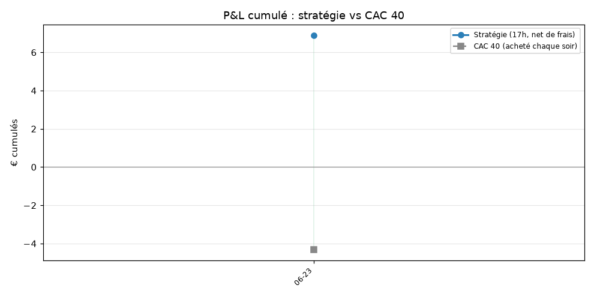
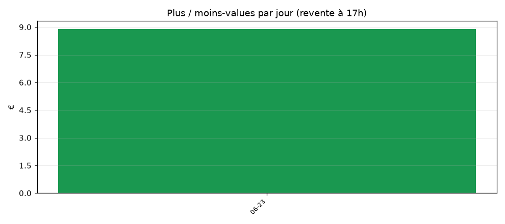
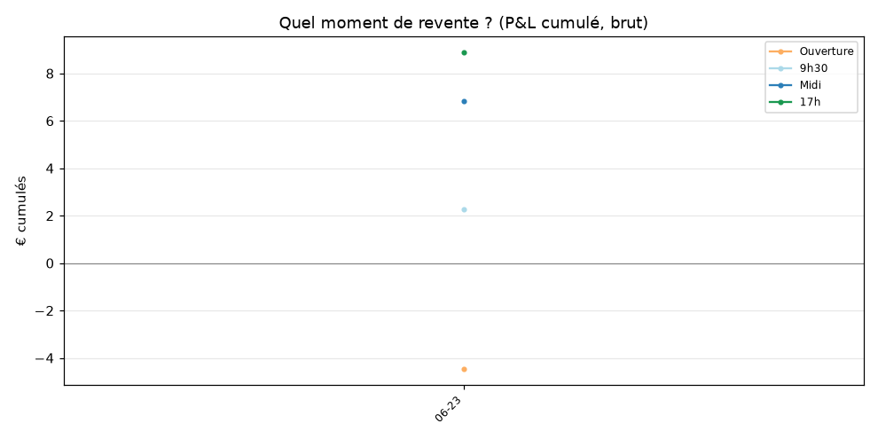

# Graphiques — plus / moins-values

_Mis à jour à chaque exécution. Apparaissent dès les premières positions évaluées._

## P&L cumulé : stratégie (net de frais) vs CAC 40

Zone verte = la stratégie bat le CAC 40 ; zone rouge = elle fait moins bien.

## Plus / moins-values par jour (revente à 17h)

## Quel moment de revente est le meilleur ?

